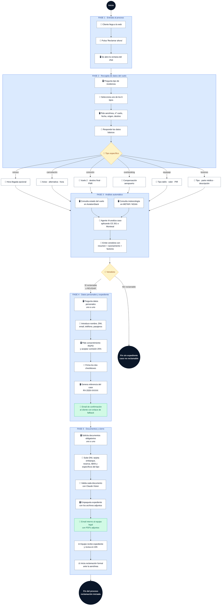
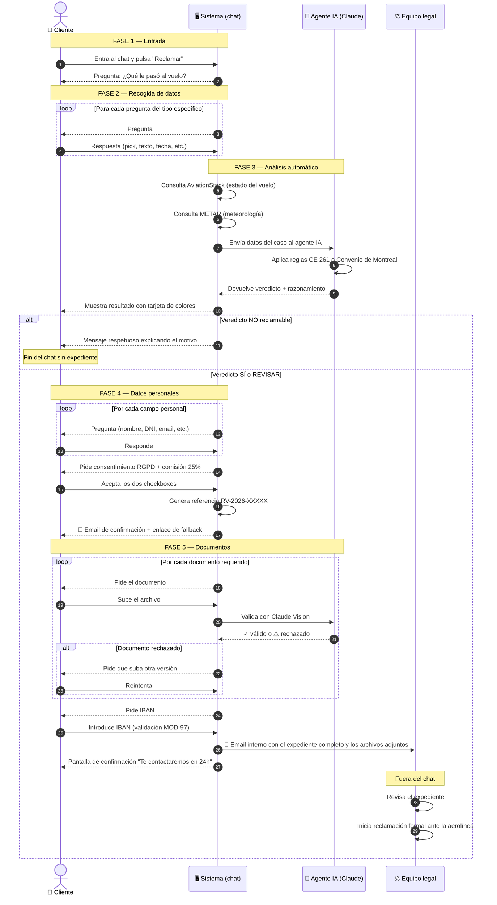
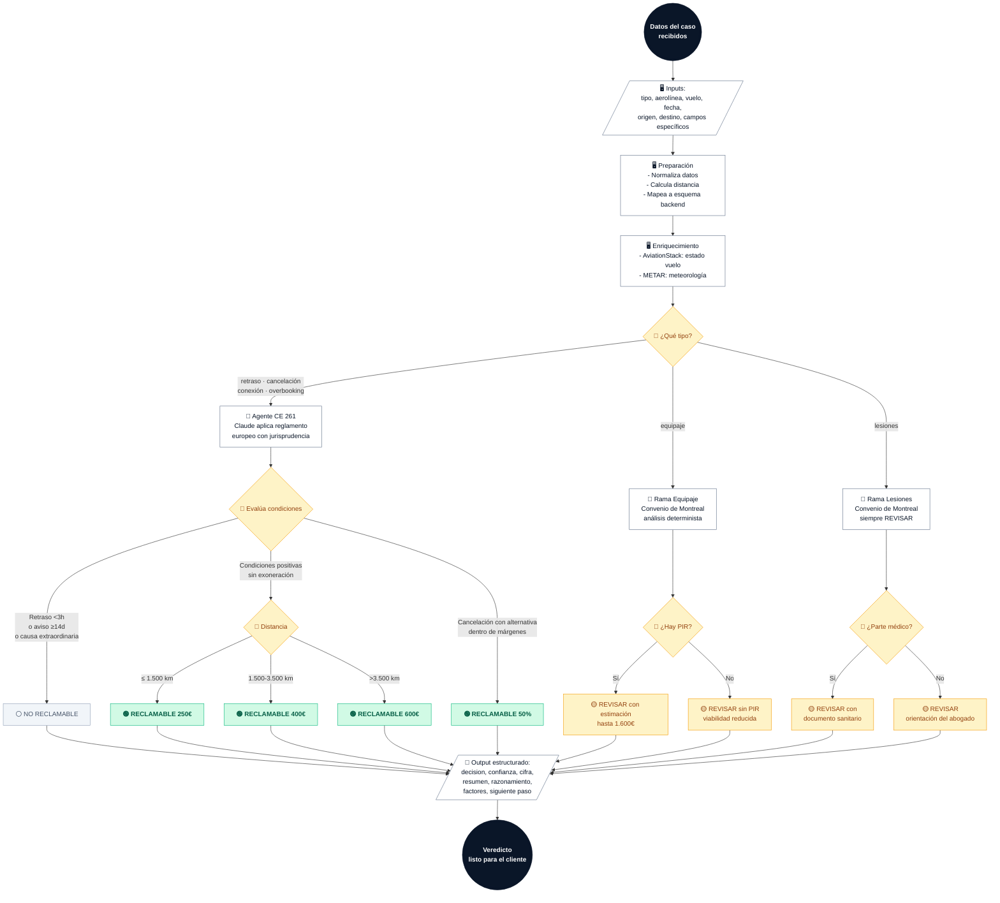
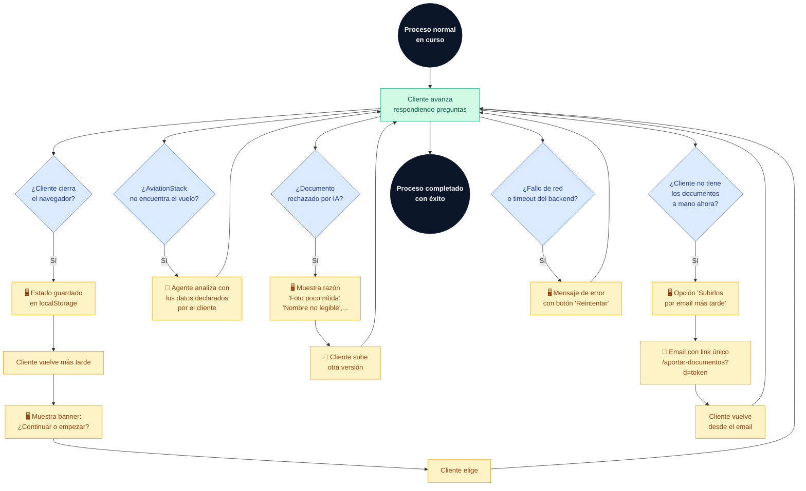

# ReclamaVuelo — Proceso de reclamación (BPM)

Diagrama de proceso al estilo **BPMN** con los 4 actores que intervienen: Cliente, Sistema (chat), Agente IA y Equipo legal. Pensado como documento operativo de proceso para imprimir o usar en reuniones.

**Notación utilizada:**

- ⚫ **Círculo negro grueso** — Evento de inicio / fin
- 🟦 **Rectángulo azul redondeado** — Tarea (acción ejecutada por un actor)
- 🔷 **Rombo azul** — Gateway (punto de decisión)
- 📩 **Rectángulo verde** — Mensaje o comunicación (email, notificación)
- 👤 **Icono de persona** — Acción del cliente
- 🖥️ **Icono de monitor** — Acción del sistema (chat, backend)
- 🤖 **Icono de robot** — Acción del agente IA (Claude)
- ⚖️ **Icono de balanza** — Acción del equipo legal

---

## 1. Proceso completo por fases

El proceso se divide en **5 fases** secuenciales. Cada fase tiene su responsable principal.

---

## 2. Interacciones entre los 4 actores (diagrama de secuencia)

Cómo se comunican los actores a lo largo del proceso, en orden cronológico. Este es el diagrama operativo más útil para entender "quién hace qué y cuándo".

**Cómo leerlo:**

- Las flechas sólidas (→) son **llamadas o acciones** de un actor hacia otro
- Las flechas discontinuas (-->) son **respuestas** del receptor
- Los bloques `alt` son **decisiones condicionales** (pasa A o pasa B)
- Los bloques `loop` son **repeticiones** (se ejecutan N veces hasta completar)
- Las notas son **agrupaciones de fase** para orientarte visualmente

---

## 3. Subproceso de análisis (el gateway principal)

Zoom sobre la fase 3, donde el agente IA toma la decisión. Este es el corazón del proceso.

---

## 4. Eventos excepcionales

Qué ocurre cuando algo se sale del camino feliz. Un proceso BPM robusto necesita definir estos flujos.

---

## 5. Matriz de responsabilidades (RACI)

Quién es responsable, aprueba, es consultado o informado en cada fase del proceso.

| Fase | Cliente | Sistema | Agente IA | Equipo legal |
|---|:-:|:-:|:-:|:-:|
| **1. Entrada al proceso** | **R** | A | — | — |
| **2. Recogida de datos del vuelo** | **R** | A | — | — |
| **3. Análisis automático** | — | C | **R** | — |
| **4. Datos personales** | **R** | A | — | I |
| **5. Subida de documentos** | **R** | A | C | I |
| **6. Envío de expediente** | I | **R** | — | I |
| **7. Reclamación formal a la aerolínea** | I | — | — | **R** |

**Leyenda:** **R** = Responsable (ejecuta la tarea) · **A** = Apoyo (ayuda a ejecutar) · **C** = Consultado (se le pide información) · **I** = Informado (recibe notificación) · **—** = No participa

---

## 6. KPIs y puntos de medida

Métricas que se pueden extraer del proceso para evaluar rendimiento:

| Métrica | Dónde se mide | Objetivo |
|---|---|---|
| **Tasa de abandono por fase** | Contar cuántos clientes entran en cada fase y cuántos llegan a la siguiente | < 15% entre fase 2 y 3 |
| **Tiempo medio por fase** | Timestamp de inicio y fin de cada fase por cliente | Fase 2: <3 min · Fase 4: <2 min · Fase 5: <4 min |
| **Tasa de reclamabilidad** | Decisiones positivas del agente / total de análisis | Orientativo, depende del tipo de tráfico |
| **Precisión del agente** | Casos donde el equipo legal está de acuerdo con el veredicto | >90% |
| **Tasa de documentos válidos al primer intento** | Validaciones OK / total de uploads | >80% |
| **Tiempo hasta contacto del equipo** | Desde email interno hasta primera respuesta al cliente | <24h |
| **Tasa de conversión a reclamación formal** | Expedientes enviados a aerolínea / expedientes recibidos | >95% |

Estas métricas se deberían instrumentar en una iteración posterior con analítica (PostHog, Umami o similar).

---

## Notación BPMN usada en este documento

Este documento usa una versión **simplificada** de BPMN (Business Process Model and Notation). Los elementos clave:

| Elemento | Símbolo | Significado |
|---|---|---|
| **Evento de inicio** | `((( Inicio )))` | Punto donde arranca el proceso |
| **Evento de fin** | `((( Fin )))` | Punto donde termina una rama |
| **Tarea** | `[Rectángulo]` | Acción concreta ejecutada por un actor |
| **Gateway (decisión)** | `{Rombo}` | Punto donde el flujo se bifurca según una condición |
| **Mensaje / comunicación** | `📩 Email` | Envío de información entre actores |
| **Subproceso** | Subgraph | Grupo de tareas que forman una fase |
| **Swimlane implícito** | Icono en cada tarea | Actor responsable (👤🖥️🤖⚖️) |

BPMN completo tiene más elementos (subproceso colapsado, eventos intermedios, compensación, temporizadores, mensajes entre pools, etc.) pero para este proceso los anteriores son suficientes.

---

**Mantenimiento del documento:** cuando se modifique el flujo del chat en `lib/conversation-script.js` o se cambie el criterio legal del agente en `lib/agent.js`, actualiza este documento para que refleje el proceso real.
