# ReclamaVuelo — Diagramas de flujos

> Todos los diagramas usan [Mermaid](https://mermaid.js.org) y se renderizan directamente en GitHub, VS Code y la mayoría de visores Markdown.

**Índice**

1. [Arquitectura general](#1-arquitectura-general)
2. [Ciclo de un turno del chat](#2-ciclo-de-un-turno-del-chat)
3. [Flujo conversacional completo](#3-flujo-conversacional-completo)
4. [Subflujos específicos por tipo de incidencia](#4-subflujos-específicos-por-tipo-de-incidencia)
   - [Retraso](#41-retraso)
   - [Cancelación](#42-cancelación)
   - [Conexión perdida](#43-conexión-perdida)
   - [Overbooking](#44-overbooking)
   - [Equipaje](#45-equipaje)
   - [Lesiones a bordo](#46-lesiones-a-bordo)
5. [Flujo de resultado del agente](#5-flujo-de-resultado-del-agente)
6. [Flujo de contacto y consentimiento](#6-flujo-de-contacto-y-consentimiento)
7. [Flujo de documentos](#7-flujo-de-documentos)
8. [Arquitectura backend](#8-arquitectura-backend)
9. [Árbol de decisión jurídico del agente](#9-árbol-de-decisión-jurídico-del-agente)

---

## 1. Arquitectura general

Alto nivel del producto: el usuario llega a la landing, entra al chat, pasa por el análisis IA, aporta contacto y documentos, y el equipo recibe un expediente completo por email.

```mermaid
flowchart LR
    A([Usuario llega a<br/>reclamavuelo.com]) --> B[Landing page]
    B --> C{¿Reclamar?}
    C -->|Sí| D[Chat conversacional<br/>/#reclamar]
    C -->|No| E[Explora servicios,<br/>calculadora, FAQ]
    E --> C

    D --> F[Recolección de datos<br/>paso a paso]
    F --> G[/api/verify<br/>Claude Sonnet + AviationStack + METAR/]
    G --> H{Decisión}
    H -->|RECLAMABLE| I[Datos personales<br/>+ documentos]
    H -->|REVISAR_MANUALMENTE| I
    H -->|NO_RECLAMABLE| J([Fin: no procede])

    I --> K[/api/submit-claim<br/>genera ref + email cliente/]
    K --> L[Upload docs con<br/>validación Claude Vision]
    L --> M[/api/finalize-claim<br/>email interno con adjuntos/]
    M --> N([Fin: expediente<br/>enviado al equipo])

    style D fill:#d1fae5
    style G fill:#fef3c7
    style K fill:#fef3c7
    style M fill:#fef3c7
    style N fill:#d1fae5
    style J fill:#f1f5f9
```

**Leyenda:** verde = estado de éxito · amarillo = llamadas a backend/IA · gris = estado terminal neutro.

---

## 2. Ciclo de un turno del chat

Lo que ocurre cada vez que el bot hace una pregunta y el usuario responde. Este ciclo se repite ~42 veces hasta completar el expediente.

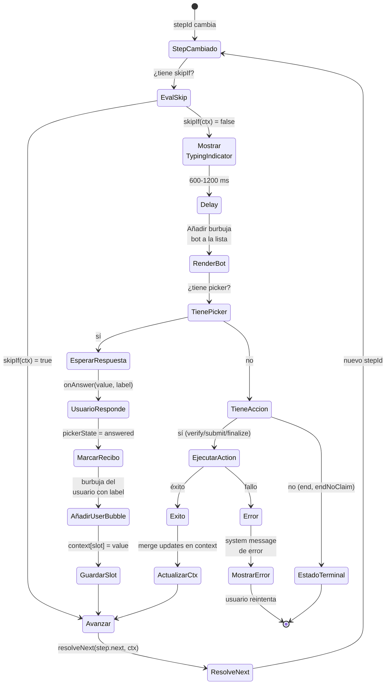

**Puntos clave:**

- **skipIf** permite saltar steps enteros (ej: `askDocsPir` se salta si `tipo !== 'equipaje'`)
- **Una burbuja del bot con picker** es la unidad interactiva — solo una está `active` a la vez
- **Los pickers viejos quedan en modo `answered`** — visibles como recibo readonly arriba en el historial
- **Las acciones (verify/submit/finalize)** son steps que no piden picker, solo ejecutan y avanzan
- **Persistencia:** tras cada cambio de `messages`/`context`/`stepId`, se guarda en `localStorage` (`rv-chat-session`)

---

## 3. Flujo conversacional completo

Los ~42 turnos del chat, con el branching por tipo de incidencia. Para simplificar, los subflujos específicos de cada tipo están en la sección 4.

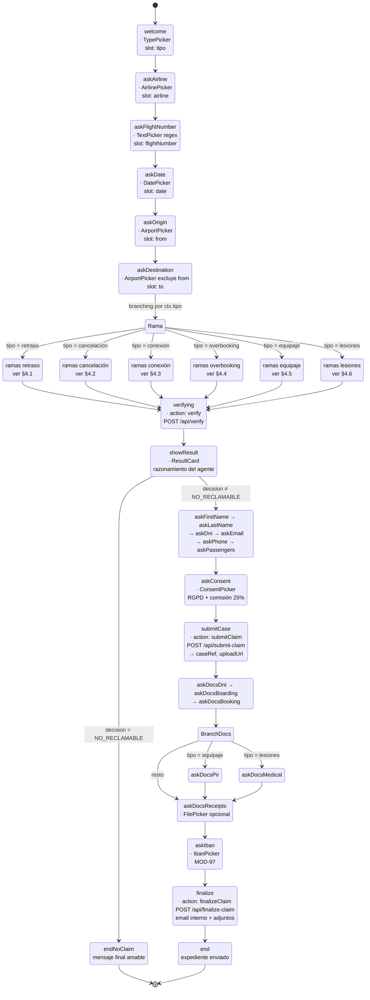

---

## 4. Subflujos específicos por tipo de incidencia

### 4.1 Retraso

El más simple: una pregunta opcional sobre la hora de llegada y directo a verificar.

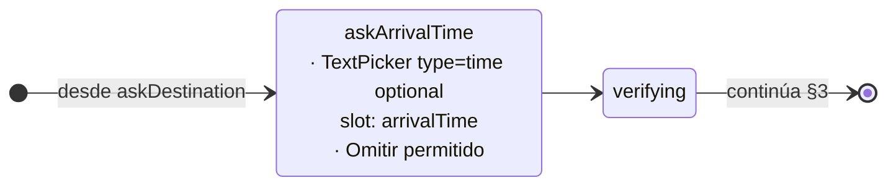

**Slots recogidos:** `arrivalTime` (opcional).

---

### 4.2 Cancelación

El más complejo: rama con sub-rama según si la aerolínea ofreció alternativa y si el usuario la aceptó.

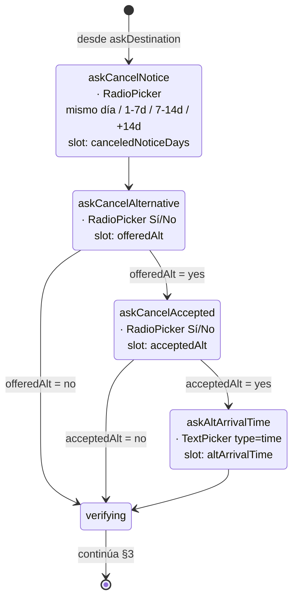

**Slots recogidos:** `canceledNoticeDays`, `offeredAlt`, `acceptedAlt`, `altArrivalTime` (condicional).

**Impacto en la decisión del agente:**

- `canceledNoticeDays = '14+'` → **NO_RECLAMABLE** por CE 261 art. 5.1.c.i
- `offeredAlt = yes` + `acceptedAlt = yes` + alternativa llegó dentro de márgenes → **RECLAMABLE 50%** (mitad de compensación)
- `offeredAlt = no` → **RECLAMABLE 100%** si no hay causa extraordinaria

---

### 4.3 Conexión perdida

Tres slots adicionales lineales, clave la pregunta del PNR.

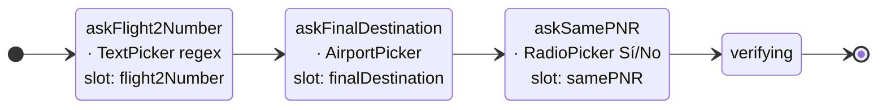

**Slots recogidos:** `flight2Number`, `finalDestination`, `samePNR`.

**Impacto en la decisión del agente:**

- `samePNR = no` → **NO_RECLAMABLE** — billetes separados, CE 261 no cubre la conexión (STJUE Wegener C-537/17 aplica solo a mismo billete)
- `samePNR = yes` + retraso ≥3h en destino final → **RECLAMABLE** sobre distancia origen→final

---

### 4.4 Overbooking

Dos slots con sub-rama si aceptó compensación voluntaria.

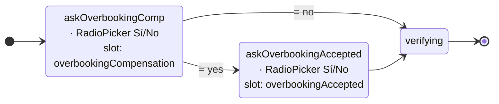

**Slots recogidos:** `overbookingCompensation`, `overbookingAccepted` (condicional).

**Impacto en la decisión del agente:**

- Denegación involuntaria (`overbookingCompensation = no` o `overbookingAccepted = no`) → **RECLAMABLE** según CE 261 art. 4.3
- Denegación voluntaria (`overbookingCompensation = yes` + `overbookingAccepted = yes`) → **REVISAR_MANUALMENTE** (depende del acuerdo firmado)

---

### 4.5 Equipaje

Pasa a Convenio de Montreal (no CE 261). El PIR es el gate principal.

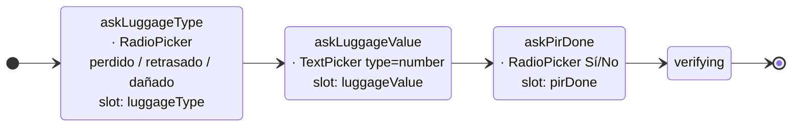

**Slots recogidos:** `luggageType`, `luggageValue`, `pirDone`.

**Impacto en la decisión del agente:**

- Regulación aplicada: **Convenio de Montreal** arts. 17.2, 22.2, 31
- `pirDone = yes` → **REVISAR_MANUALMENTE** con estimación hasta 1.600€ (límite 1.288 DEG)
- `pirDone = no` → **REVISAR_MANUALMENTE** con advertencia de que sin PIR la reclamación es difícil (plazos: 7 días daño / 21 días retraso, art. 31.2)

---

### 4.6 Lesiones a bordo

Convenio de Montreal art. 17.1 (responsabilidad objetiva). El parte médico es clave.

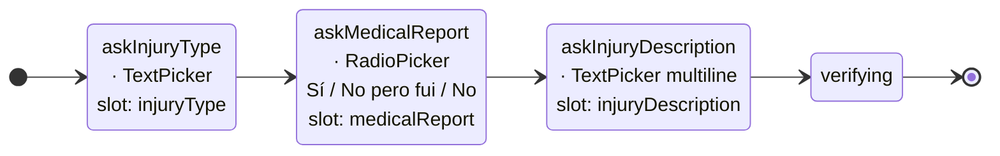

**Slots recogidos:** `injuryType`, `medicalReport`, `injuryDescription`.

**Impacto en la decisión del agente:**

- Siempre **REVISAR_MANUALMENTE** (la compensación varía demasiado caso a caso)
- Regulación: Convenio de Montreal art. 17.1 — responsabilidad objetiva hasta 128.821 DEG (~160.000€)
- `medicalReport = yes` → alta prioridad, abogado contacta para estimar
- `medicalReport ≠ yes` → abogado orienta sobre cómo obtener la prueba médica

---

## 5. Flujo de resultado del agente

Qué pasa tras `verifying`, según lo que devuelve Claude.

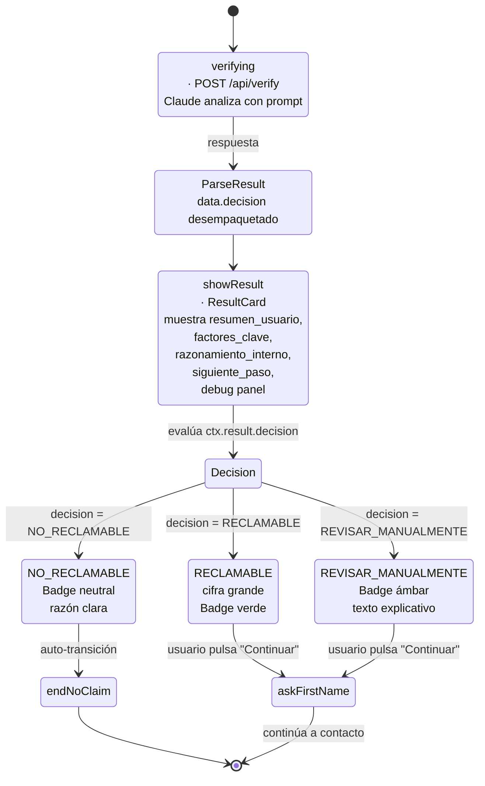

**Qué devuelve el agente (schema):**

```json
{
  "decision": "RECLAMABLE" | "NO_RECLAMABLE" | "REVISAR_MANUALMENTE",
  "confianza": "ALTA" | "MEDIA" | "BAJA",
  "compensacion_estimada": 250,
  "resumen_usuario": "Sí, reclamable. 250€ por retraso superior a 3h.",
  "razonamiento_interno": "CE 261 art. 7.1.a + doctrina Sturgeon C-402/07.",
  "factores_clave": ["Retraso ≥3h", "Distancia ≤1.500 km", "Sin extraordinaria"],
  "siguiente_paso": "Inicia tu reclamación y adjunta tarjeta de embarque.",
  "regulation": "CE 261/2004"
}
```

---

## 6. Flujo de contacto y consentimiento

Tras aprobar el resultado, 6 steps lineales para datos personales + 1 de consentimiento.

```mermaid
stateDiagram-v2
    direction LR
    [*] --> askFirstName

    askFirstName: askFirstName<br/>TextPicker
    askFirstName --> askLastName

    askLastName: askLastName<br/>TextPicker
    askLastName --> askDni

    askDni: askDni<br/>TextPicker transform=upper
    askDni --> askEmail

    askEmail: askEmail<br/>TextPicker type=email<br/>regex básico
    askEmail --> askPhone

    askPhone: askPhone<br/>TextPicker type=tel
    askPhone --> askPassengers

    askPassengers: askPassengers<br/>TextPicker type=number<br/>min 1
    askPassengers --> askConsent

    askConsent: askConsent<br/>· ConsentPicker<br/>2 checkboxes:<br/>RGPD + comisión 25%
    askConsent --> submitCase

    submitCase: submitCase<br/>action: submitClaim<br/>→ caseRef, uploadUrl
    submitCase --> [*]
```

**Slots recogidos:** `firstName`, `lastName`, `dni`, `email`, `phone`, `passengers`.

**Validaciones del TextPicker:**

| Campo | Regex | Ejemplo |
|---|---|---|
| `firstName` | sin regex | María |
| `lastName` | sin regex | García López |
| `dni` | `^[A-Z0-9]{6,15}$` + transform `upper` | 12345678A, X1234567L, P1234567 |
| `email` | `^[^\s@]+@[^\s@]+\.[^\s@]+$` | user@dominio.com |
| `phone` | sin regex estricto | +34 600 000 000 |
| `passengers` | `^[1-9]\d{0,2}$` | 1 a 999 |

---

## 7. Flujo de documentos

Tras crear el caso, 4-5 uploads según tipo + IBAN final.

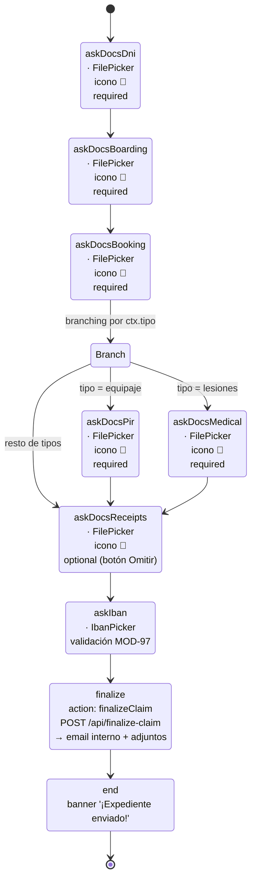

**Flujo interno del FilePicker:**

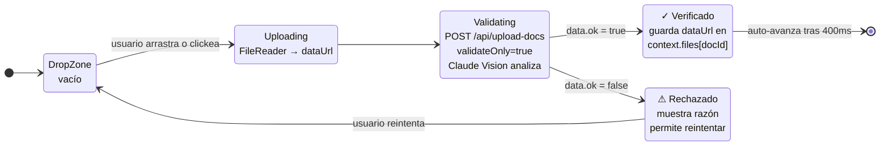

**Documentos por tipo:**

| Tipo | DNI | Boarding | Booking | PIR | Médico | Recibos |
|---|---|---|---|---|---|---|
| retraso | ✓ | ✓ | ✓ | — | — | opcional |
| cancelacion | ✓ | ✓ | ✓ | — | — | opcional |
| conexion | ✓ | ✓ | ✓ | — | — | opcional |
| overbooking | ✓ | ✓ | ✓ | — | — | opcional |
| **equipaje** | ✓ | ✓ | ✓ | **✓** | — | opcional |
| **lesiones** | ✓ | ✓ | ✓ | — | **✓** | opcional |

---

## 8. Arquitectura backend

Cómo interactúan los 4 endpoints y las integraciones externas.

```mermaid
flowchart TB
    Chat[/Chat.jsx<br/>state machine/] -->|POST tras askDestination| Verify[/api/verify]
    Chat -->|POST tras askConsent| Submit[/api/submit-claim]
    Chat -->|POST por cada doc| Upload[/api/upload-docs?validateOnly]
    Chat -->|POST tras askIban| Finalize[/api/finalize-claim]

    Verify --> AviationStack[(AviationStack<br/>dep_iata fallback<br/>plan gratuito)]
    Verify --> METAR[(NOAA<br/>aviationweather.gov)]
    Verify --> AgentCE261[lib/agent.js<br/>CE 261 branch]
    Verify --> AgentMontreal[lib/agent.js<br/>Montreal branch<br/>determinista]

    AgentCE261 --> Claude1[Claude Sonnet 4.6<br/>prompt con jurisprudencia]
    AgentMontreal -.->|no llama a Claude| Claude1

    Submit --> Resend1[(Resend<br/>email confirmación<br/>al usuario)]
    Submit --> Token[Genera token base64<br/>con datos del caso]

    Upload --> ClaudeVision[Claude Vision<br/>validateDocs.js]

    Finalize --> Resend2[(Resend<br/>email interno al equipo<br/>con PDFs adjuntos)]
    Finalize --> Buffer[Convierte dataUrl<br/>base64 a Buffer]

    Resend1 --> Email1([Email al usuario<br/>+ link upload token])
    Resend2 --> Email2([Email al equipo<br/>con N archivos adjuntos<br/>ref_DNI.jpg, ref_Boarding.pdf, ...])

    style Chat fill:#d1fae5
    style Verify fill:#fef3c7
    style Submit fill:#fef3c7
    style Upload fill:#fef3c7
    style Finalize fill:#fef3c7
    style Claude1 fill:#e0e7ff
    style ClaudeVision fill:#e0e7ff
    style Email1 fill:#d1fae5
    style Email2 fill:#d1fae5
```

**Estados del caso a lo largo del backend:**

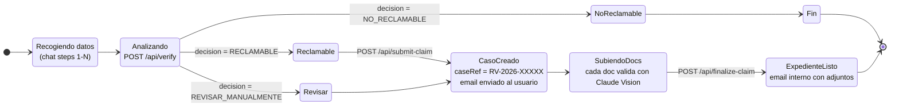

---

## 9. Árbol de decisión jurídico del agente

Cómo Claude clasifica cada caso según las reglas aplicables.

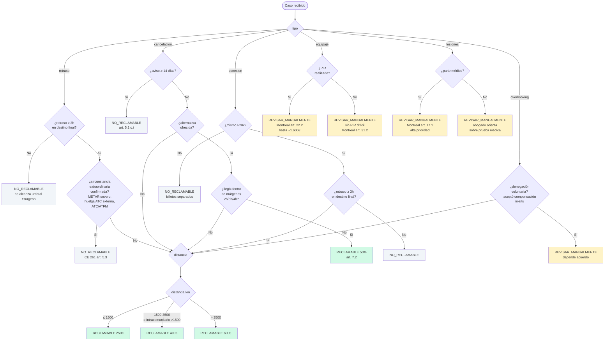

**Leyenda:**

- 🟢 Verde: decisiones **RECLAMABLE** con cifra estimada
- 🟡 Ámbar: **REVISAR_MANUALMENTE** (requiere revisión humana del abogado)
- ⚪ Gris: **NO_RECLAMABLE**

**Referencias jurídicas clave:**

- **CE 261/2004** — Reglamento del Parlamento Europeo sobre derechos del pasajero aéreo
- **Sturgeon (C-402/07)** — STJUE que extiende la compensación a retrasos ≥3h
- **Wallentin (C-549/07)** — define "circunstancia extraordinaria"
- **Airhelp/SAS (C-28/20)** — distingue huelgas propias (reclamables) de ajenas (no)
- **Wegener (C-537/17)** — conexiones mismo PNR evaluadas como transporte único
- **Niki Luftfahrt (C-532/18)** — define "accidente" para responsabilidad art. 17 Montreal
- **Convenio de Montreal 1999** arts. 17 (muerte/lesión), 17.2 (equipaje), 22 (límites), 31 (plazos de protesta)

---

## Mantenimiento de estos diagramas

Cuando cambies la máquina de estados en `lib/conversation-script.js`, actualiza los diagramas relevantes (§3 y §4). Si añades un nuevo tipo de incidencia, necesitas:

1. Añadirlo a `lib/services.js`
2. Añadirlo como rama en el `next` de `askDestination`
3. Crear la secuencia de steps específicos del tipo
4. Añadirlo al switch del agente en `lib/agent.js`
5. Actualizar §3 (flujo general) y añadir §4.7 (subflujo del nuevo tipo)
6. Actualizar el árbol de decisión del §9

Los diagramas de backend (§8) y ciclo de turno (§2) son más estables — solo cambian si tocas la arquitectura base.
