# ReclamaVuelo — Flujos del chat de reclamación

Este documento describe **qué pregunta el chat al cliente**, en qué orden, y cómo cambian las preguntas según sus respuestas. Es la versión legible para el equipo que gestiona las reclamaciones. Todos los diagramas están en Mermaid y se ven directamente en GitHub.

**Índice**

1. [Visión general](#1-visión-general)
2. [Recorrido común al principio](#2-recorrido-común-al-principio)
3. [Preguntas según el tipo de incidencia](#3-preguntas-según-el-tipo-de-incidencia)
   - [Retraso](#retraso)
   - [Cancelación](#cancelación)
   - [Conexión perdida](#conexión-perdida)
   - [Overbooking](#overbooking)
   - [Equipaje](#equipaje)
   - [Lesiones a bordo](#lesiones-a-bordo)
4. [Resultado del análisis](#4-resultado-del-análisis)
5. [Datos personales y consentimiento](#5-datos-personales-y-consentimiento)
6. [Subida de documentos](#6-subida-de-documentos)
7. [Final del proceso](#7-final-del-proceso)
8. [Cuándo se dice "sí", "no" o "revisar"](#8-cuándo-se-dice-sí-no-o-revisar)

---

## 1. Visión general

El cliente entra en la web y habla con un asesor virtual. El chat le va haciendo preguntas una a una. Al final recoge:

- **Qué pasó con el vuelo** y sus detalles concretos
- **Datos personales** y consentimiento
- **Documentos** para el expediente

Cuando termina, el equipo legal recibe un email con el caso completo y todos los archivos adjuntos.

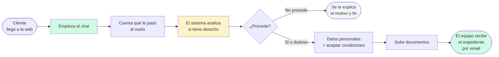

---

## 2. Recorrido común al principio

Todos los clientes empiezan respondiendo las mismas 6 preguntas básicas, sin importar qué tipo de incidencia tengan. Son los datos del vuelo.

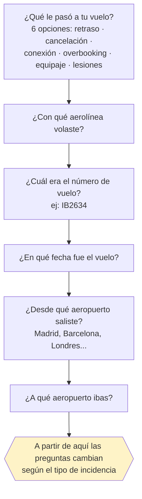

Una vez contestadas, el chat salta a las preguntas específicas del tipo de incidencia elegido.

---

## 3. Preguntas según el tipo de incidencia

### Retraso

Una sola pregunta adicional, y opcional.

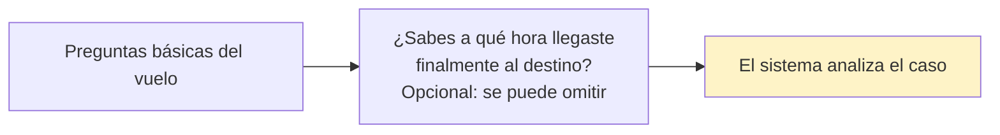

**Qué necesita el equipo saber:** hora real de llegada si la conoce. Si no, lo buscamos con datos operacionales.

---

### Cancelación

El tipo con más ramificación. Dependiendo de si hubo alternativa y si la aceptó, el flujo cambia.

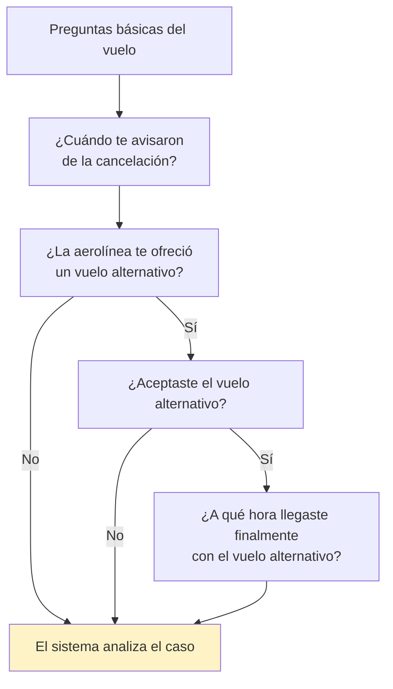

**Opciones de la pregunta "¿Cuándo te avisaron?":** Mismo día · 1-7 días antes · 7-14 días antes · Más de 14 días.

**Qué necesita el equipo saber:** si el aviso fue con más de 14 días, la reclamación no procede (la aerolínea cumplió el Reglamento). Si hubo alternativa y llegó con poco retraso, la compensación puede reducirse a la mitad.

---

### Conexión perdida

Tres preguntas adicionales. La más importante es si los dos vuelos estaban en la misma reserva.

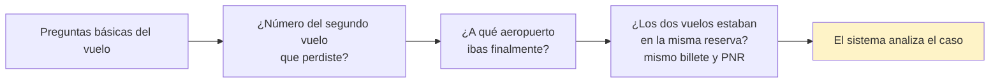

**Qué necesita el equipo saber:** si los billetes eran separados (distinto PNR), la conexión perdida no está cubierta por la normativa europea — el cliente asumió el riesgo al comprar dos billetes independientes.

---

### Overbooking

Dos preguntas sobre si la aerolínea intentó compensar en el aeropuerto.

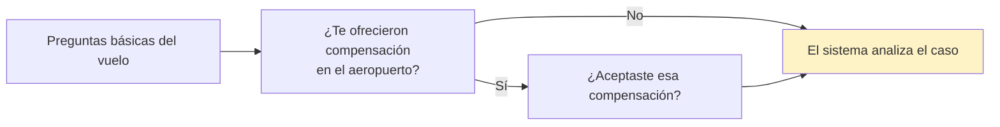

**Qué necesita el equipo saber:** si el cliente aceptó voluntariamente la compensación ofrecida en el mostrador (bonos, vuelo posterior, alojamiento...), el caso se marca para revisión manual porque depende de lo que firmó. Si fue denegación involuntaria, normalmente procede la compensación automática del Reglamento.

---

### Equipaje

Tres preguntas sobre el daño/pérdida y el parte en el aeropuerto.

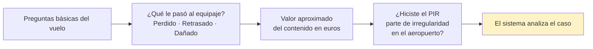

**Qué necesita el equipo saber:** el PIR es **imprescindible** para reclamar por equipaje. Sin PIR, el caso pasa a revisión manual con advertencia de que la viabilidad es baja (hay un plazo de 7 días para daños y 21 días para retrasos). El límite legal de compensación es aproximadamente 1.600€ por pasajero según el Convenio de Montreal.

---

### Lesiones a bordo

Tres preguntas sobre la lesión y el parte médico.

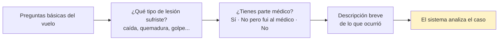

**Qué necesita el equipo saber:** todos los casos de lesiones van a revisión manual (un abogado estudia el expediente) porque la compensación varía mucho según gravedad y documentación médica aportada. El marco legal es el Convenio de Montreal y la aerolínea responde sin necesidad de probar culpa.

---

## 4. Resultado del análisis

Tras las preguntas, el sistema analiza el caso y da uno de tres veredictos. El chat lo muestra al cliente con colores distintos y el razonamiento jurídico.

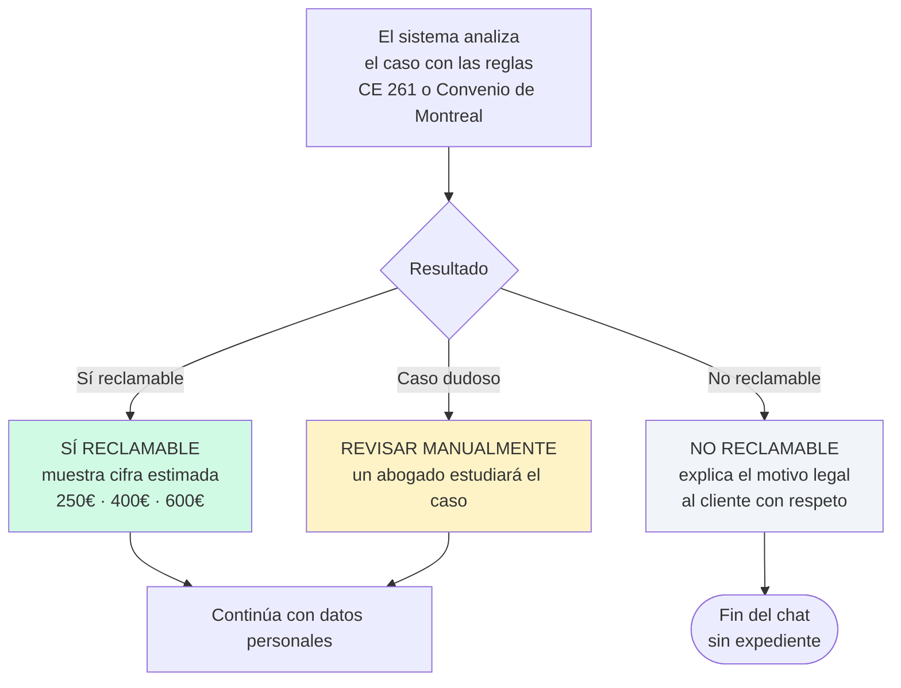

**Qué ve el cliente:**

- **Sí reclamable** → tarjeta verde con la cifra grande, factores clave que ha considerado el análisis (ej: "retraso ≥3h", "sin causa extraordinaria") y el siguiente paso
- **No reclamable** → tarjeta neutra (no roja — no queremos ser hostiles) con la razón jurídica clara
- **Revisar manualmente** → tarjeta ámbar con explicación de por qué necesita revisión humana

---

## 5. Datos personales y consentimiento

Solo si el resultado ha sido "sí reclamable" o "revisar". Si fue "no reclamable", el chat termina antes.

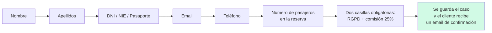

**Qué firma el cliente:**

1. Política de privacidad y tratamiento de datos
2. Aceptación de la comisión del 25% + IVA sobre la compensación obtenida (solo si se consigue)

**Qué pasa en este momento:** se genera una referencia de caso (`RV-2026-XXXXX`) y se manda un email al cliente confirmando que hemos recibido su reclamación con un enlace por si más tarde quiere añadir documentos.

---

## 6. Subida de documentos

El cliente sube los archivos necesarios. Cada uno se analiza automáticamente para verificar que es legible y coherente con el caso antes de avanzar a la siguiente pregunta.

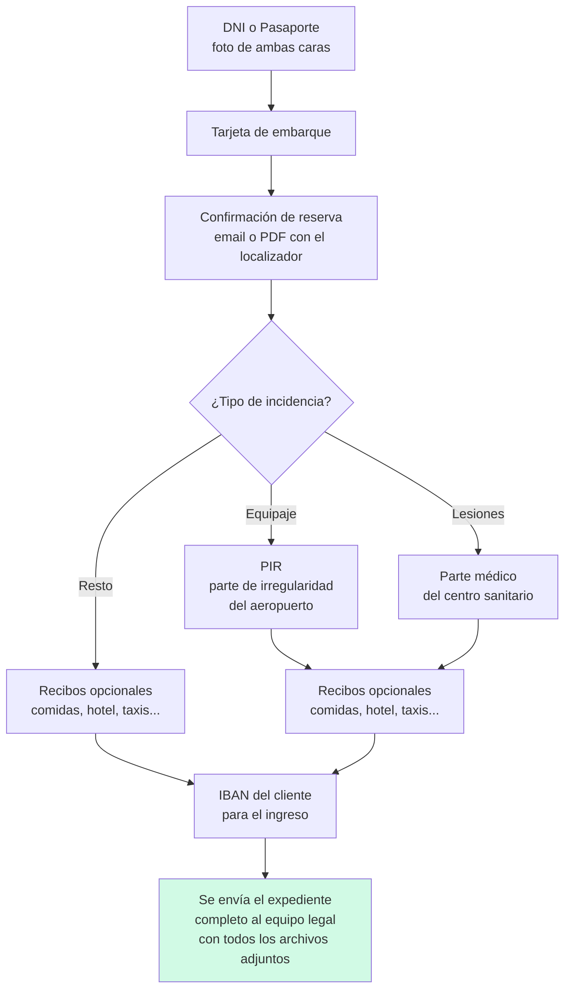

**Qué documentos son obligatorios según el caso:**

| Tipo de incidencia | DNI | Tarjeta embarque | Reserva | PIR | Parte médico | Recibos |
|---|:-:|:-:|:-:|:-:|:-:|:-:|
| Retraso | ✓ | ✓ | ✓ | — | — | opcional |
| Cancelación | ✓ | ✓ | ✓ | — | — | opcional |
| Conexión | ✓ | ✓ | ✓ | — | — | opcional |
| Overbooking | ✓ | ✓ | ✓ | — | — | opcional |
| Equipaje | ✓ | ✓ | ✓ | **✓** | — | opcional |
| Lesiones | ✓ | ✓ | ✓ | — | **✓** | opcional |

**Validación automática:** cada archivo se revisa con IA antes de aceptarse. Si un documento no es legible o está incompleto, el chat le pide al cliente que suba otra versión antes de continuar.

---

## 7. Final del proceso

Cuando el cliente termina todos los pasos, el equipo legal recibe un email con:

- **Referencia del caso** (`RV-2026-XXXXX`)
- **Datos del cliente** y del vuelo
- **Decisión del análisis** y razonamiento jurídico
- **Todos los documentos adjuntos** nombrados con la referencia: `RV-2026-XXXXX_DNI.jpg`, `RV-2026-XXXXX_TarjetaEmbarque.pdf`, etc.
- **IBAN** del cliente para el futuro ingreso

El cliente ve una pantalla final confirmando que todo se ha enviado correctamente y que se le contactará en 24 horas.

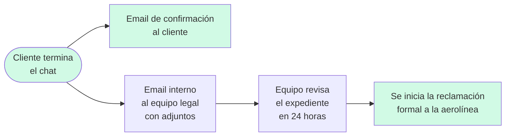

---

## 8. Cuándo se dice "sí", "no" o "revisar"

Esto es el resumen del criterio que usa el análisis automático para clasificar cada caso. Está basado en el **Reglamento (CE) 261/2004** y en el **Convenio de Montreal 1999**.

### Cuándo SÍ es reclamable

| Situación | Cifra |
|---|---|
| Retraso de 3 horas o más en el destino final, sin causa justificada | 250€ / 400€ / 600€ según distancia |
| Cancelación avisada con menos de 14 días de antelación, sin causa justificada | 250€ / 400€ / 600€ según distancia |
| Cancelación con alternativa que llegó con mucho retraso | 250€ / 400€ / 600€ según distancia |
| Conexión perdida con los dos vuelos en el mismo billete y retraso final ≥3h | 250€ / 400€ / 600€ según distancia |
| Denegación de embarque involuntaria por overbooking | 250€ / 400€ / 600€ según distancia |
| Cancelación con alternativa que llegó dentro de márgenes (2h/3h/4h) | **La mitad** de la cifra |

**Cifras según la distancia del vuelo:**

- ≤ 1.500 km → 250€
- 1.500 a 3.500 km (o intracomunitario superior a 1.500 km) → 400€
- Más de 3.500 km fuera de la UE → 600€

### Cuándo NO es reclamable

- Retraso inferior a 3 horas (no alcanza el umbral mínimo establecido por el Tribunal de Justicia europeo)
- Cancelación avisada con **más de 14 días** de antelación (la aerolínea cumplió la normativa)
- Causa extraordinaria confirmada:
  - Meteorología realmente severa (nevada intensa, niebla densa, tormenta importante)
  - Huelga de controladores aéreos u otros terceros ajenos a la aerolínea
  - Restricciones de ATC/Eurocontrol documentadas
  - Riesgos de seguridad o inestabilidad política
- Conexión perdida con **billetes separados** (distinto PNR) — la normativa no cubre enlaces autogestionados

### Cuándo pasa a REVISAR MANUALMENTE

- **Overbooking con compensación aceptada voluntariamente** en el aeropuerto → depende del acuerdo concreto firmado con la aerolínea
- **Equipaje** (cualquier caso) → la compensación varía según documentación aportada, aplica Convenio de Montreal no CE 261
- **Lesiones a bordo** → siempre revisión humana, los importes son muy variables y dependen del parte médico

---

## Notas para el equipo

- **El sistema es conservador con las causas extraordinarias:** solo las considera si hay evidencia real (p.ej. el parte meteorológico del aeropuerto confirma la severidad, o hay noticia pública de una huelga). No basta con que la aerolínea lo alegue.
- **Un caso clasificado como "no reclamable" no significa que no se pueda intentar.** El cliente siempre puede contactar con nosotros si cree que hay matices que el análisis automático no ha considerado.
- **En "revisar manualmente" es obligatorio que un abogado valide antes de enviar la reclamación** a la aerolínea.
- **Los importes que muestra el chat son estimaciones.** La cifra final puede variar según documentación probatoria adicional y lo que finalmente acepte la aerolínea o decida el juzgado.
- **El chat guarda la conversación** mientras el cliente la mantiene abierta. Si cierra el navegador y vuelve, aparece un banner ofreciendo continuar donde lo dejó.

---

**Mantenimiento del documento:** si cambia alguna pregunta del chat, se añade un tipo nuevo, o se actualizan los criterios legales, actualiza este archivo para que refleje lo que ve realmente el cliente.
