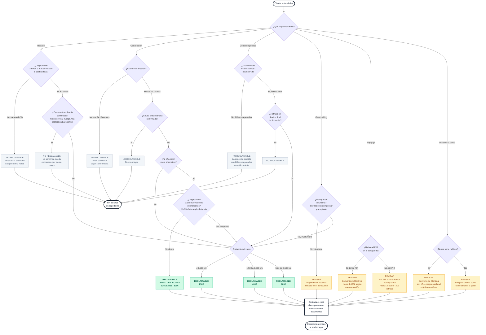
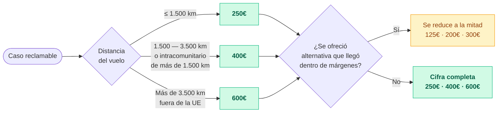
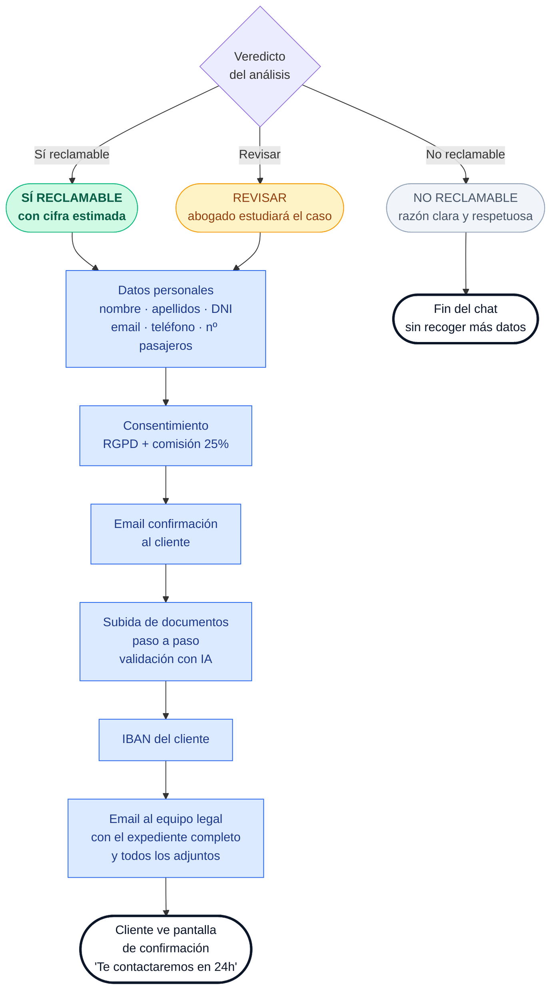
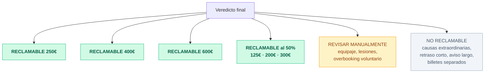

# ReclamaVuelo — Mapa de decisión

Un único mapa visual con todo el árbol de decisiones del chat. Pensado para imprimir en A3 o proyectar en pantalla grande durante una sesión del equipo.

**Código de colores en todos los diagramas:**

- 🟢 **Verde** — El caso sí es reclamable. Cifra estimada al lado.
- ⚪ **Gris** — El caso no es reclamable. Fin del proceso.
- 🟡 **Ámbar** — Revisar manualmente. Un abogado debe estudiar el expediente antes de decidir.

---

## 1. Mapa completo de decisión

Este es el árbol entero, de principio a fin. Todo lo que puede ocurrir cuando un cliente entra al chat.

---

## 2. Mapa de distancia → cifra

Cuando el caso es "sí reclamable", la cifra depende solo de la distancia del vuelo. Esta es la regla:

**Ejemplos reales:**

- Madrid → Barcelona (480 km) → 250€
- Madrid → Londres (1.250 km) → 250€
- Madrid → Atenas (2.370 km) → 400€
- Madrid → Berlín (1.860 km) → 400€
- Madrid → Nueva York (5.760 km) → 600€
- Madrid → Buenos Aires (10.050 km) → 600€

**Márgenes de reducción al 50%** (sólo aplica a cancelaciones con alternativa aceptada):

- ≤ 1.500 km → llegar con menos de **2 horas** de retraso
- 1.500 a 3.500 km → menos de **3 horas**
- Más de 3.500 km → menos de **4 horas**

---

## 3. Mapa de qué ocurre después del veredicto

Tras el análisis, el chat sigue uno de dos caminos: continúa con el cliente hasta completar el expediente, o termina con un mensaje respetuoso si no procede.

---

## 4. Resumen visual en una tabla

Si los diagramas son demasiado para un vistazo rápido, esta tabla condensa todo el criterio de clasificación:

| Tipo | Condición positiva | Condición negativa | Cifra |
|---|---|---|---|
| **Retraso** | Llegada con 3h o más de retraso | Menos de 3h **o** causa extraordinaria | 250€ / 400€ / 600€ |
| **Cancelación** | Aviso con menos de 14 días, sin alternativa razonable | Aviso ≥14 días **o** causa extraordinaria **o** alternativa dentro de márgenes (50% si dentro) | 250€ / 400€ / 600€ (o 50%) |
| **Conexión** | Mismo billete y retraso final ≥3h | Billetes separados **o** retraso final <3h | 250€ / 400€ / 600€ |
| **Overbooking** | Denegación involuntaria | Aceptó compensación voluntaria (→ revisar) | 250€ / 400€ / 600€ |
| **Equipaje** | Con PIR hecho en el aeropuerto | — (siempre revisar) | Hasta 1.600€ (revisar) |
| **Lesiones** | Con parte médico | — (siempre revisar) | Variable (revisar) |

---

## 5. Los 6 veredictos posibles en una sola vista

---

## Nota sobre cómo leer los diagramas

- **Los rombos azules** son preguntas que hace el sistema o decisiones que toma el algoritmo
- **Los rectángulos verdes** son resultados positivos con compensación
- **Los rectángulos ámbar** son casos que requieren intervención humana
- **Los rectángulos grises** son casos que terminan sin expediente
- **Las cápsulas con borde negro** son puntos de inicio o fin del proceso

Las flechas indican el camino que sigue el flujo según cada respuesta del cliente o cada condición evaluada.

Todos los diagramas de este documento se renderizan automáticamente en GitHub, VS Code con extensión Mermaid, y en la mayoría de visores Markdown modernos.
